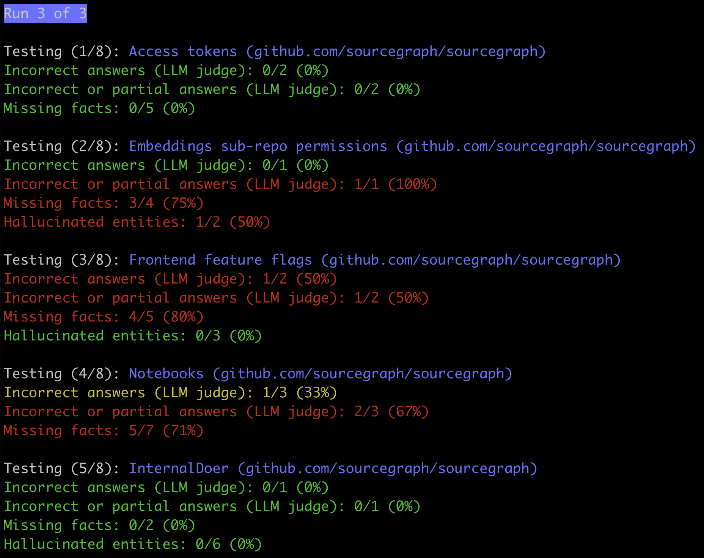

# Cody end-to-end quality evaluation suite



The end-to-end evaluation suite runs a set of test cases desinged to evaluate the quality of Cody responses. It measures:

- Answer correctness - the percentage of test cases where Cody provides a correct answer as judged by an LLM.
- Facts - how many facts defined in the test case are included in the answer.
- Hallucinations - the percentage of hallucinated entities in the answer (symbols, file paths, ...).

Individually, these metrics don't tell the full story. They should always be interpreted together to get a complete picture of Cody's performance.

TODO:

- Add web app to view and analyze the test results.
- Add 100+ test cases.
- Add support for non-chat recipes.

## Running the suite

Set the following environment variables:

```sh
export ANTHROPIC_API_KEY=...
export SRC_ENDPOINT=... # Sourcegraph instance endpoint to test against.
export SRC_ACCESS_TOKEN=...
```

Run the suite:

```sh
$ pnpm run start
```

CLI options available:

```sh
$ pnpm run start --help
Usage: cody-e2e [options]

Cody E2E quality evaluation suite

Options:
  -V, --version     output the version number
  --output <value>  Output tests results to the given file. (default: "")
  --label <value>   Run tests with the matching label. (default: "")
  --runs <value>    Number of runs. (default: 1)
  -h, --help        display help for command
```

## Adding a test case

```ts
addTestCase('Access tokens', {
  // Codebase to test against.
  codebase: 'github.com/sourcegraph/sourcegraph',
  // Context type.
  context: 'embeddings',
  transcript: [
    {
      question: 'How do access tokens work?',
      // Facts we want to see in the response.
      facts: ['Authorization'],
      // Summary of the desired response. LLM judge uses this to evaluate correctness.
      answerSummary:
        'Access tokens allow users to make authenticated requests to the API using the `Authorization` header.',
    },
    {
      question: 'Show me an example of using access tokens using Python and requests',
      facts: ['import requests', 'Authorization', 'requests.post', '/.api/graphql'],
      answerSummary:
        'A Python code snippet calling the Sourcegraph API with an access token using the `requests` module.',
    },
  ],
})
```
