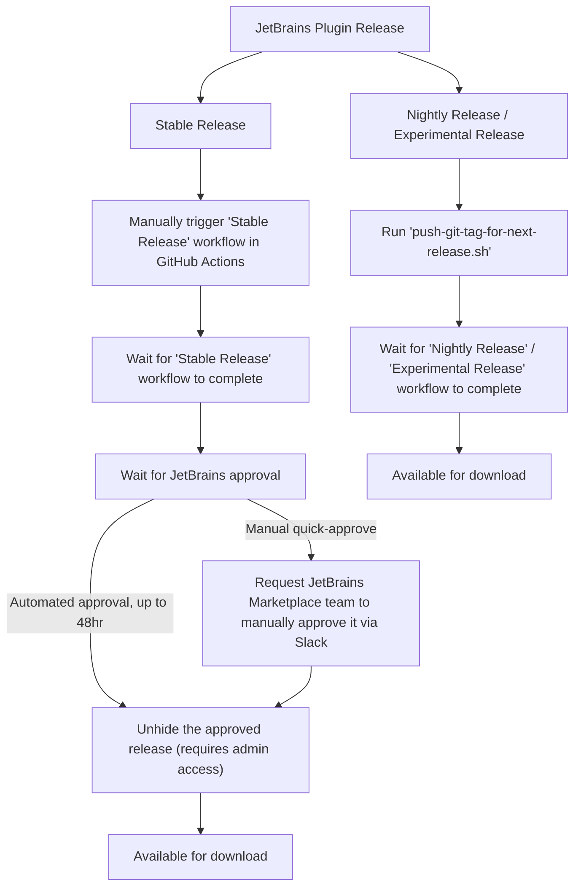

# Contributing to Sourcegraph JetBrains Plugin

Thank you for your interest in contributing to Sourcegraph! The goal of this
document is to provide a high-level overview of how you can contribute to the
Sourcegraph JetBrains Plugin.

## Issues / Bugs

New issues and feature requests can be filed through
our [issue tracker](https://github.com/sourcegraph/cody/issues/new/choose).

## Development

### Prerequisites

**Java 17:** we recommend installing via SDKMAN! https://sdkman.io. Once you have SDKMAN! installed,
run `sdk use java 17-zulu`. Confirm that you have Java 17 installed with `java -version`.

> 🤞 On Windows, SDKMAN requires some Linux tools. If you don't have WSL, use the git bash environment and then:
>
> ```
> winget install -e --id GnuWin32.Zip
> ```
>
> ⚠️ If that fails with the following error message, you should install https://winget.azureedge.net/cache/source.msix
>
> ```
> Failed in attempting to update the source: winget
> Failed when searching source: winget
> An unexpected error occurred while executing the command:
> 0x8a15000f : Data required by the source is missing
> ```
>
> Once you Gnu zip installs:
>
> ```
> mkdir ~/bin
> cp /usr/bin/unzip ~/bin/zip  # Yes, unzip and zip are the same binary
> curl -s "https://beta.sdkman.io" | bash
> source "${HOME}/.sdkman/bin/sdkman-init.sh"
> sdk selfupdate force
> sdk use java 17-zulu
> ```
  
**Set up the Cody agent dev environment:**

- Clone `https://github.com/sourcegraph/cody`
- Install its dependencies. The easiest way
      is [with `asdf`](https://github.com/sourcegraph/cody/blob/main/doc/dev/index.md). If not using `asdf`, you just
      need to install the dependency versions listed in the `.tool-versions` file in that repository.
- From the root directory of the repository, `pnpm install && cd lib && pnpm build && cd ../agent && pnpm build`

> 🤞 On Windows ARM64:
> - There's no Chromium aarch64 binary (installed by Puppeteer)
> - There's no sentry-cli aarch64 binary (Sentry.)
>
> To skip fetching these binaries, run:
> 
> ```
> $env:PUPPETEER_SKIP_CHROMIUM_DOWNLOAD="true"
> $env:SENTRYCLI_SKIP_DOWNLOAD=1
> pnpm install
> ```
>
> From this point, YMMV, but you should be able to build agent!

### Running

| What                                                                                                     | Command                                                                  |
|----------------------------------------------------------------------------------------------------------|--------------------------------------------------------------------------|
| Run the plugin locally                                                                                   | `./gradlew :customRunIde`                                                |
| Run the plugin locally with fresh build of Cody                                                          | `./gradlew -PforceAgentBuild=true :customRunIde`                         |
| Run the plugin locally with fresh build of Code Search assets                                            | `./gradlew -PforceCodeSearchBuild=true :customRunIde`                    |
| Run the plugin locally with different IntelliJ version                                                   | `./gradlew -PplatformRuntimeVersion=2024.2.0.2 :customRunIde`            |
| Run the plugin locally in split mode (useful for Gateway testing)                                        | `./gradlew -PsplitMode=true :customRunIde`                               |
| Build Code Search assets (separate terminal)                                                             | `pnpm build`                                                             |
| Continuously re-build Code Search assets (separate terminal)                                             | `pnpm watch`                                                             |
| Code Search "Find with Sourcegraph" window                                                               | `pnpm standalone && open http://localhost:3000/`                         |
| Build deployable plugin                                                                                  | `./gradlew buildPlugin` (artifact is generated in `build/distributions`) |
| Reformat Java and Kotlin sources                                                                         | `./gradlew spotlessApply`                                                |
| Debug agent JSON-RPC communication                                                                       | `tail -f build/sourcegraph/cody-agent-trace.json`                        |

### Editor config

- Install the following two IntelliJ plugins to format Java and Kotlin on file save
    - https://plugins.jetbrains.com/plugin/8527-google-java-format
    - https://plugins.jetbrains.com/plugin/14912-ktfmt

### Troubleshooting

Few tips and tricks regarding versioning of the tooling:

- If you are using macOS and chose not to use `asdf`, use `corepack`, not `brew`, to install `pnpm`
  version `8.6.7`: `corepack install --global pnpm@8.6.7`
  Currently `brew` does not allow you to pick custom `pnpm` version which is
  causing [various issues](https://github.com/pnpm/pnpm/issues/6903).
- Use `node` version `18` (newer versions causes hard to diagnose errors with `ERR_INVALID_THIS`).
- If you changed `pnpm` or `node` version after running gradle you need to kill gradle daemon with `./gradlew --stop`.
  Otherwise you won't see effects of your changes.
- IF you get error 134 while building different things with jetbrains its because java process doesn't have enough
  memory to build so you might need to get into your activity monitor to close other processes.

### Building on Windows

You should build everything in PowerShell. Git Bash, Ubuntu and MinGW all offer unique challenges. If you get it to build and run, add instructions here.

- Install JDK 17 from https://www.oracle.com/java/technologies/javase/jdk17-archive-downloads.html
  - Oracle will make you create an account in order to download it. 🙄 
- Install the pnpm version in `./tool-versions`
  - Set `PNPM_HOME` env var for whole system (not just for your account) to the path where `pnpm.cmd` is.
- Install the node version in `./tool-versions`

🤞 On Windows (ARM64 specific?), there's some problem with codesearch's svelte packages. Skip the code search build by setting this environment variable:
```
$env:SKIP_CODE_SEARCH_BUILD="true"
```

## Using Nightly/Experimental channel releases

- Open "Sourcegraph & Cody" settings
- Change to "Nightly"/"Experimental" update channel
- Open "Plugins"
- Update Sourcegraph plugin
- Restart IDE

Remove the URL from the plugin repository list to go back to the stable channel.

### Wiring unstable-codegen via SOCKS proxy

**INTERNAL ONLY** This section is only relevant for Sourcegraph engineers.
Take the steps below _before_ [running JetBrains plugin with agent](#developing-jetbrains-plugin-with-the-agent).

- Point IntelliJ provider/endpoint at the desired LLM endpoint by editing `$HOME/.sourcegraph-jetbrains.properties`:
  ```
  cody.autocomplete.advanced.provider: unstable-codegen
  cody.autocomplete.advanced.serverEndpoint: https://backend.example.com/complete_batch
  ```
- Run `gcloud` SOCKS proxy to access the LLM backend:
    - Make sure to authorize with GCP: `gcloud auth login`
    - Request Sourcegraph GCP access through Entitle.
    - Bring up the proxy:
      ```
      gcloud --verbosity "debug" compute ssh --zone "us-central1-a" "codegen-access-test" --project "sourcegraph-dogfood" --ssh-flag="-D" --ssh-flag="9999" --ssh-flag="-N"
      ```
    - Patch in [sg/socks-proxy](https://github.com/sourcegraph/cody/compare/sg/socks-proxy?expand=1).
      Note: After [#56254](https://github.com/sourcegraph/sourcegraph/issues/56254) is resolved this step is not needed
      anymore.

## Publishing a New Release

### Historical context
We used to publish both stable and nightly channel versions at once. 
In that approach QA testing and JB approval happened in parallel. 
However, it consumed a lot of CI time and JB time for the releases that did not pass our QA 
(and did not go public eventually). Hence, we decided to use a sequential process.
We trigger the stable channel release only after the nightly channel release passes QA.



We aim to cut a new release to "nightly" mid week, every week. If QA or dogfood find issues we backport fixes and
do updated nightly releases. At the end of a week, we re-cut the best build as "stable".

### 1. Push a git tag & publish a nightly release

Use the following command for a **patch** release:

```shell
./scripts/push-git-tag-for-next-release.sh --patch
```

Or this one for a **minor** release:

```shell
./scripts/push-git-tag-for-next-release.sh --minor
```

Or this one for a **major** release
(note it should be user only on special occasions):

```shell
./scripts/push-git-tag-for-next-release.sh --major
```

This script runs `verify-release.sh`, which takes a long time to run with a clean cache, which is why we don't run it in
CI. When you have a local cache of IDEA installations then this script can run decently fast (~1-2min).

After successfully pushing the new tag (for example: `v6.0.15`), we are now able to publish.

Wait for the `Release to Marketplace` GitHub workflow to complete.

### 2. Publish a stable release 

Go to [Stable Release workflow](https://github.com/sourcegraph/cody/actions/workflows/stable-release.yml),
click `Run workflow` and select the tag that has been pushed before (and tested by QA team), run it.

It can take up to 48hr for stable releases to get approved by the JetBrains Marketplace team.
It's possible to expedite this process by posting a message in the `#marketplace` channel in
the [JetBrains Slack workspace](https://plugins.jetbrains.com/slack/).

### 3. Publish a New Release on GitHub

For every stable release, create a GitHub release summarizing the changes.

Visit [releases page](https://github.com/sourcegraph/cody/releases) and click `Draft a new release`, choose your
tag and use `Generate release notes`. Release notes should appear automatically. Be aware that the automatic release are
based on the history of commits, so sometimes the titles are not properly formatted, capitalized or grammatically
correct. **This may sometimes require manual tweaks.**

Try to maintain a similar style to that of the previous releases, similar
to [our first release](https://github.com/sourcegraph/jetbrains/releases/tag/v5.2.2301).

It's also optional create GitHub releases for nightly builds where it makes sense.

### 4. Announce the New Release on our internal Slack channel

It is mandatory to post about both stable and nightly releases on our internal
`#team-cody-clients` Slack channel. You can refer to past posts in the channel's
history for examples.

## Enabling web view debugging

Parts of this extension rely on the [JCEF](https://plugins.jetbrains.com/docs/intellij/jcef.html) web view features
built into the JetBrains platform. To enable debugging tools for this view, please follow these steps:

1. [Enable JetBrains internal mode](https://plugins.jetbrains.com/docs/intellij/enabling-internal.html)
2. Open Find Actions: (<kbd>Ctrl+Shift+A</kbd> / <kbd>⌘⇧A</kbd>)
3. Search for "Registry..." and open it
4. Find option `ide.browser.jcef.debug.port`
5. Change the default value to an open port (we use `9222`)
6. Restart IDE
7. Open the “Find with Sourcegraph” window (<kbd>Alt+A</kbd> / <kbd>⌥A</kbd>)
8. Switch to a browser window, go to [`localhost:9222`](http://localhost:9222), and select the Sourcegraph window.
   Sometimes it needs some back and forth to focus the external browser with the JCEF component also focused—you may
   need to move the popup out of the way and click the external browser rather than using <kbd>Alt+Tab</kbd> / <kbd>
   ⌘Tab</kbd>.

# Enabling IntelliJ to debug the Agent

If you have IntelliJ Ultimate Edition, you can debug the Agent in JetBrains.
This is useful because you can set breakpoints on both sides of the protocol:
On the agent (TypeScript) side, and also on the plugin (Java/Kotlin) side.

There are two supported configurations for debugging this way:

1. The Cody extension spawns the agent subprocess normally, but adds `--inspect`
    - JetBrains can connect and debug the agent via port 9229
2. Or, JetBrains spawns the agent in debug mode
    - The agent will listen on port 3113
    - The Cody extension connects via socket to the "remote" agent

Option 1 is the simplest, and probably makes the most sense for you
to use if you are uncertain which method to use for debugging. Option 2
is especially useful when you need to set a breakpoint very early in
the Agent startup.

## How to set up Run Configurations

Run configurations are basically IDEA's launcher scripts. You will need
to create one run configuration in each project window, using Run → Edit
Configurations.

For both debugging setups (Cody-spawns and JB-spawned), you will need:

- `sourcegraph/cody` (TypeScript) opened in one IDEA project window
    - this is a Node project _(requires Ultimate Edition)_
- `sourcegraph/cody jetbrains` opened in a second IDEA project window
    - this is a Gradle project

You'll always have at least 2 IntelliJ project windows open: One for
debugging the Java side, and one for the TS side.

- also a 3rd intellij window pops up when you run your plugin,
  though this is a new instance completely

If you check `Store as project file` and use the default, it will
remember your configuration between sessions.

For each configuration below, you can use whatever name you like, but
the other configuration all needs to be there.

### Starting a debug session

With both debug options, you can start the run configurations in either
order, using either Run or Debug to launch them.

In each project window, decide whether you need breakpoints on this side
of the protocol to trigger in this run. If so, use Debug; otherwise, use Run.

Typically it makes the most sense to run both of them with Debug.
You can have breakpoints triggered on both sides of the protocol in
different windows, which can be handy.

## Option 1: Cody spawns a debuggable Agent

This option requires you to set up two run configurations, one in each
project window.

### Extension Run Config

Create this configuration in the `sourcegraph/cody jetbrains` project window.
Choose Edit Configurations and `+` to add a new one:

- Type: Gradle
- Name: whatever, e.g. `Cody-spawned debug agent`
- Run on: local machine _(the default)_
- Run: `customRunIde` _(the default)_
- Modify options → Add Before Launch Task
    - choose Run External Tool
    - choose the pnpm builder tool
- Gradle project: `jetbrains` _(the default)_
- env vars:
    - `CODY_AGENT_DEBUG_INSPECT=true`
        - this tells the plugin to spawn agent with `--inspect`

Use `CODY_AGENT_DEBUG_INSPECT=wait` to make the agent wait for the debugger to attach.

### Agent Run Config

Create this configuration in the `sourcegraph/cody` project window.
Choose Edit Configurations and `+` to add a new one:

- Type: Attach to Node.js/Chrome
- Name: whatever, e.g. Debug Cody-spawned Agent
- Host: localhost
- Port: 9229
- Attach to: `Chrome or Node.js > 6.3 started with --inspect`
- Reconnect automatically: yes

## Option 2: Cody connects to remote Agent

This option has two run configurations, different from two above. Note that
if you want both debugging options available, you can set up all four run
configurations.

### Extension Run Config

Create this configuration in the `sourcegraph/cody jetbrains` project window:

- Type: Gradle
- Name: whatever, e.g., `Connect to IDEA-spawned Agent`
- Run on: local machine _(the default)_
- Run: `customRunIde` _(the default)_
- env vars:
    - `CODY_AGENT_DEBUG_REMOTE=true`
    - `CODY_AGENT_DEBUG_PORT=3113`

### Agent Run Config

Create this configuration in the `sourcegraph/cody` project window:

- Type: Node
- Name: Agent on Debug Port
- Node interpreter: node
    - Mine defaulted to `~/.asdf/shims/node`
    - make sure your node is >= the version in https://github.com/sourcegraph/cody/blob/main/package.json
- Node parameters: `--enable-source-maps`
- Working directory: `~/src/sg/cody` (or wherever you cloned sourcegraph/cody)
- JavaScript file: `agent/dist/index.js`
    - note: this is a relative path, unlike the run configs for Option 2
- Application Parameters: leave empty
- Environment variables:
    - `CODY_AGENT_DEBUG_REMOTE=true`
    - `CODY_AGENT_DEBUG_PORT=3113`
- before actions: use your pnpm external tool if you want to auto-rebuild the agent

## Auto-rebuilding the Agent

This step is optional but recommended.

With any Agent-side run configurations, you can opt to build the agent
before running the task as a "Before Task", which speeds up development
iteration. You can make code changes to the TypeScript and just hit
Debug or Run, and it will `pnpm build` your repo before spawning the agent.

Note that for Option 1 (Cody spawns Agent), the Before Task is added to the run
configuration on the java side. For IntelliJ spawning the Agent, the Before Task is
added to the run configuration on the TypeScript side.

### Setup

To set this up, in the Before launch section of any Run/Debug configuration, do the following:

- click on + to see the Add New Task popup list
- choose Run External Tool
    - this will bring up your personal/custom External Tools list
- choose + in the External Tools dialog to add a new one
    - this should pop up a Create Tool form dialog
- Configuration:
    - Name: whatever you like
        - example: pnpm build agent
    - Description: whatever you like
        - example: run pnpm build in sourcegraph/cody/agent dir
    - Tool Settings:
        - Program: pnpm
        - Arguments: build
        - Working directory: `/Users/you/path/to/sourcegraph/cody/agent`
            - e.g. mine was `/Users/stevey/src/sg/cody/agent`
    - for other settings, the defaults are fine, or you can customize them
- Finally, go back to your Before Actions in your run configuration
    - click on + to see the Add New Task popup list again
        - your new pnpm build task should be in it
    - click on your new task to add it to the Before Actions

You only need to do most of these steps once, when you create the
External Tool. Then you can use it in any run config that spawns the
agent, to rebuild it first.

## Debugging VS Code

Sometimes, the TypeScript backend behaves differently when called from
IntelliJ via Agent than when the same code is called from the VS Code
extension, and you may need to debug the same code paths through the
Agent twice. First, when called from the JetBrains extension side, and
again when called from the VS Code extension side.

To accomplish the latter, you can use VS Code to debug itself. It works
very similarly to how it works in JetBrains. There are predefined run
configurations for debugging VS Code Cody in the file
`.vscode/launch.json` in `sourcegraph/cody`, such as `Launch VS Code
Extension (Desktop)`.

You do not launch VS Code run configurations from the command palette.
Instead, use ctrl-shift-D to open the Run and Debug view, and you can
see the configuration dropdown at the top.

## Tracing TypeScript Performance

Chrome Tracing can be used to get CPU and memory profiles of Agent and the TypeScript extension code.

1. Set `CODY_AGENT_DEBUG_INSPECT=true` in your run configuration/environment.
2. Launch the target.
3. Open DevTools however you're accustomed to do that, for example, `chrome://inspect` and click "inspect" next to the
   debuggee.
4. Use the Performance tab to record CPU, memory profiles, etc.

## Known Issues

- Force-stopping the target often corrupts IntelliJ's project indexes,
  requiring an extra restart of the debugged target to fix them.
    - Workaround is to exit the target gracefully by quitting each time,
      using the menus or hotkeys, rather than force-stopping it.

# Integration Testing

Run the integration tests at the command line with:

```
./gradlew integrationTest
```

You need to import valid access tokens
using [export-cody-http-recording-tokens.sh](https://github.com/sourcegraph/cody/blob/main/agent/scripts/export-cody-http-recording-tokens.sh)
script also used for a Cody agent
tests.

You can run and debug the integration tests, including the Agent node
process, with the instructions above by making new run configurations
for the test.
