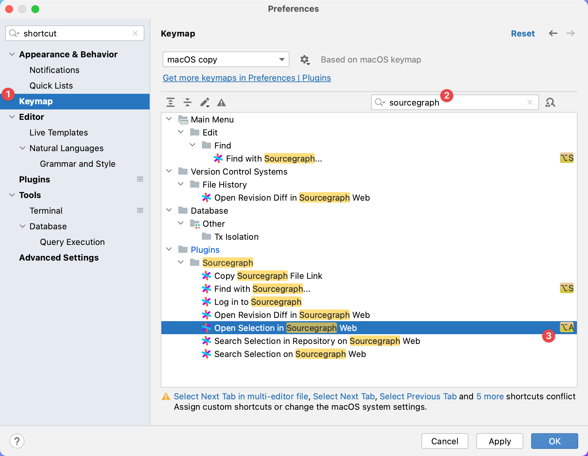

<!-- Plugin description -->

# Cody: AI Code Assistant

Use Cody, the AI coding assistant, plus Code Search directly from your JetBrains IDE.

- [Cody](https://about.sourcegraph.com/cody?utm_source=plugins.jetbrains.com&utm_medium=referral) is an AI coding assistant that helps you understand, write, and fix code faster. It uses advanced search to pull context from both local and remote codebases so that you can use context about APIs, symbols, and usage patterns from across your entire codebase at any scale, all from within your JetBrains IDE.
- [Code Search](https://about.sourcegraph.com/code-search?utm_source=plugins.jetbrains.com&utm_medium=referral) lets you search code across all your repositories and code hosts—even the code you don’t have locally.

## Cody Features

### Agentic Chat

Designed to simplify and accelerate developer workflows, Sourcegraph uses intent detection and a combination of search, AI chat, and prompts in a single interface to streamline how you explore, understand, and generate code.

### Prompts

Streamline your development process by using prompts to understand, improve, fix, document, and generate unit tests for your code. You can also create your own prompts and save them in the Prompt Library to tailor Sourcegraph to your workflow.

### Autocomplete

Autocompletes single lines, or whole functions, in any programming language, configuration file, or documentation. It’s powered by the latest instant LLM models, for accuracy and performance.

### Works with your favorite IDEs

Sourcegraph is available on the IDEs you use today. Get AI chat, autocomplete, and inline edit without changing your workflow.

### The best context

When tools focus solely on individual productivity, teams face inconsistent and poor-quality results. Sourcegraph focuses on team productivity using whole codebase context and shared prompts to ensure quality and consistency across your enterprise.

### The best models

Sourcegraph users can select the LLM they want to use for chat and experiment to choose the best model for the job. Choose from multiple options including Claude 3.5 Sonnet, Gemini 1.5 Pro, and Mixtral 8x7B. Cody Pro users can also select Claude 3 Opus and GPT-4o. [See the full list of model options here](https://sourcegraph.com/docs/cody/capabilities/supported-models).

## Choose Your LLM

Cody users can select the LLM they want to use for chat and experiment to choose the best model for the job. Choose from multiple options including Claude 3.5 Sonnet, Gemini 1.5 Pro, and Mixtral 8x7B. Cody Pro users can also select Claude 3 Opus and GPT-4o. [See the full list of model options here](https://sourcegraph.com/docs/cody/capabilities/supported-models).

Administrators for Sourcegraph Enterprise instances can configure which model options to let team members choose from.

## Engineered for the enterprise

Sourcegraph is built to support the needs of the largest enterprises, with flexible deployment and support for enterprise security and compliance.

## Usage

This extension works for all Cody plans, including Cody Free, Cody Pro, and Cody Enterprise.

You can find detailed information about Cody's available plans [on our website](https://sourcegraph.com/pricing?utm_source=marketplace.visualstudio.com&utm_medium=referral).

## Programming Languages

Cody works for any programming language because it uses LLMs trained on broad data. Cody works great with Python, Go, JavaScript, and TypeScript code.

[Contact us](https://about.sourcegraph.com/contact/request-info?utm_source=plugins.jetbrains.com&utm_medium=referral) to set up a trial of Cody Enterprise. If you’re an existing Sourcegraph Enterprise customer, contact your technical advisor.

## Feedback

- [Issue tracker](https://github.com/sourcegraph/cody/issues)
- [Discord chat](https://discord.gg/s2qDtYGnAE)
- [Twitter (@sourcegraph)](https://twitter.com/sourcegraph)

## License

[Cody's code](https://github.com/sourcegraph/jetbrains) is open source (Apache License 2.0).

## Code Search features

- Search with Sourcegraph directly from inside the IDE
- Instantly search in all open source repos and your private code
- Peek into any remote repo in the IDE, without checking it out locally

## URL sharing features

- Create URLs to specific code blocks to share them with your teammates
- Open your files on Sourcegraph

<!-- Plugin description end -->

## Supported IDEs 

The plugin works with all JetBrains IDEs, including:

- IntelliJ IDEA
- IntelliJ IDEA Community Edition
- PhpStorm
- WebStorm
- PyCharm
- PyCharm Community Edition
- RubyMine
- AppCode
- CLion
- GoLand
- DataGrip
- Rider
- Android Studio

**Versions 2022+ Recommended**

**Exception:** Due to a Java bug, search doesn't work with IDE versions **2021.1** and **2021.2** for users with **Apple Silicone** CPUs.

## Installation

- Open settings
  - Windows: Go to `File | Settings` (or use <kbd>Ctrl+Alt+S</kbd>)
  - Mac: Go to `IntelliJ IDEA | Preferences` (or use <kbd>⌘,</kbd>)
- Click `Plugins` in the left-hand pane, then the `Marketplace` tab at the top
- Search for `Sourcegraph`, then click the `Install` button
- Make sure that the `git` command is available in your PATH. We’re going
  to [get rid of this dependency](https://github.com/sourcegraph/sourcegraph/issues/40452), but for now, the plugin
  relies on it.
- Restart your IDE if needed
- To search with Sourcegraph, press <kbd>Alt+S</kbd> (<kbd>⌥S</kbd> on Mac).
- To share a link to your code or search through the website, right-click in the editor, and choose an action under
  the `Sourcegraph` context menu item.
- To use your private Sourcegraph instance, open `Settings | Tools | Sourcegraph` and enter your URL and access token.

## Settings

### List of in-app settings and how to use them

- **Authorization**: List of accounts that can be used to interact with the plugin. Each account can be configured with:
  - **Server**: The URL of your Sourcegraph instance. It can be configured with your private instance if you're adding an enterprise account.
  - **Token**: See our [user docs](https://sourcegraph.com/docs/cli/how-tos/creating_an_access_token) for a video guide on how to
    create an access token.
  - **Custom request headers**: Any custom headers to send with every request to Sourcegraph.
    - Use any number of pairs: `header1, value1, header2, value2, ...`.
    - Example: `Authorization, Bearer 1234567890, X-My-Header, My-Value`.
    - Whitespace around commas doesn't matter.
- **Default branch name**: The branch to use if the current branch is not yet pushed to the remote.
  - Usually "main" or "master", but can be any name
- **Remote URL replacements**: You can replace specific strings in your repo's remote URL.
  - Use any number of pairs: `search1, replacement1, search2, replacement2, ...`.
  - Pairs are replaced from left to right. Whitespace around commas doesn't matter.
  - **Important:** The replacements are done on the Git remote-formatted URL, not the URL you see in the browser!
    - Example replacement subject for Git: `git@github.com:sourcegraph/sourcegraph.git`
    - Example replacement subject for Perforce: `perforce@perforce.company.com:depot-name.perforce`
    - Anatomy of the replacement subjects:
      - The username is not used.
      - Between the `@` and the `:` is the hostname
      - After the `:` is the organization/repo name (for Git) or the depot name (for Perforce)
      - The `.git` / `.perforce` extension is not used.
    - When you do the replacements, make sure you **keep the colon**.
    - In the case of a custom `repositoryPathPattern` being set for your code host in your private Sourcegraph instance,
      you may try to set up a pattern that uses the `@`, `:`, and `.git`/`.perforce` boundaries, _or_ specify a
      replacement
      pair for _each repo_ or _each depot_ you may have. If none of these solutions work for you, please raise this
      at [support@sourcegraph.com](mailto:support@sourcegraph.com), and we'll prioritize making this more convenient.
- **Globbing**: Determines whether you can specify sets of filenames with wildcard characters.
- **Cody completions**: Enables/disables Cody completions in the editor.
  - The completions are disabled by default.

### Git remote setting

By default, the plugin will use the git remote called `origin` to determine which repository on Sourcegraph corresponds
to your local repository. If your `origin` remote doesn't match Sourcegraph, you may instead configure a Git remote by
the name of `sourcegraph`. It will take priority when creating Sourcegraph links.

### Setting levels

You can configure the plugin on three levels:

1. **Project-level** On the project level you are able to configure your default account, default branch name and remote url replacements
2. **Application-level** All other settings are stored here

## System Properties

### Autocomplete system properties

In order to disable newly introduced features we are giving an option to disable them via system properties:

1. **Disable formatting autocomplete elements** `cody.autocomplete.enableFormatting=false`

## Managing Custom Keymaps

You can configure JetBrains to set custom keymaps for Sourcegraph actions:

1. Open the JetBrains preferences panel and go to the Keymap page.
2. Filter by "sourcegraph" to see actions supplied by this plugin.
3. Now select an option to overwrite the keymap information and supply the new bindings.

## Questions & Feedback

If you have any questions, feedback, or bug report, we appreciate if you [open an issue on GitHub](https://github.com/sourcegraph/cody/issues/new?labels=question).

## Uninstallation

- Open settings
  - Windows: Go to `File | Settings` (or use <kbd>Ctrl+Alt+S</kbd>)
  - Mac: Go to `IntelliJ IDEA | Preferences` (or use <kbd>⌘,</kbd>)
- Click `Plugins` in the left-hand pane, then the `Installed` tab at the top
- Find `Sourcegraph` → Right click → `Uninstall` (or uncheck to disable)
