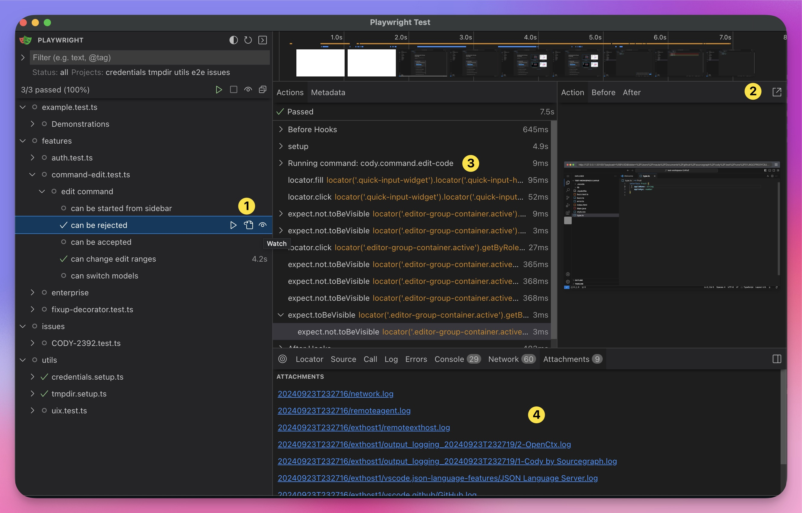
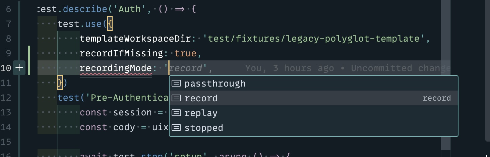
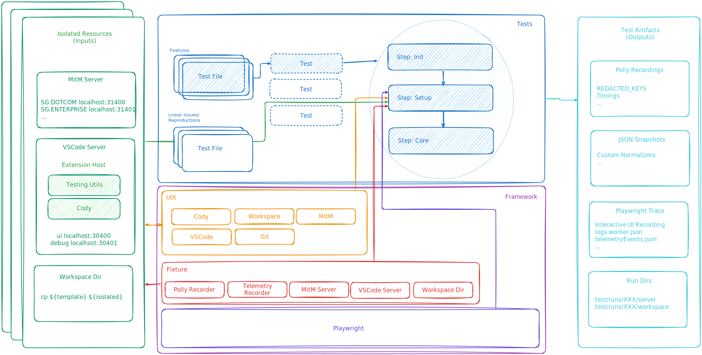
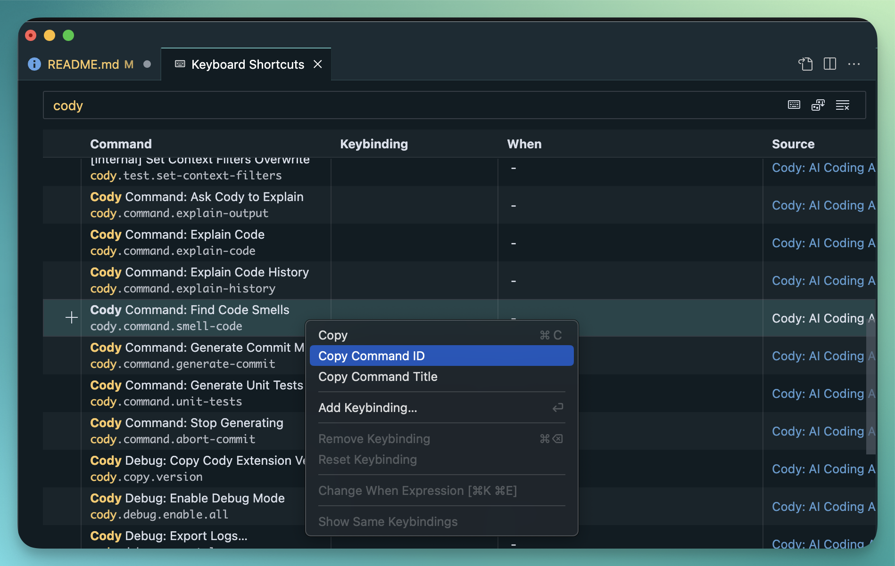
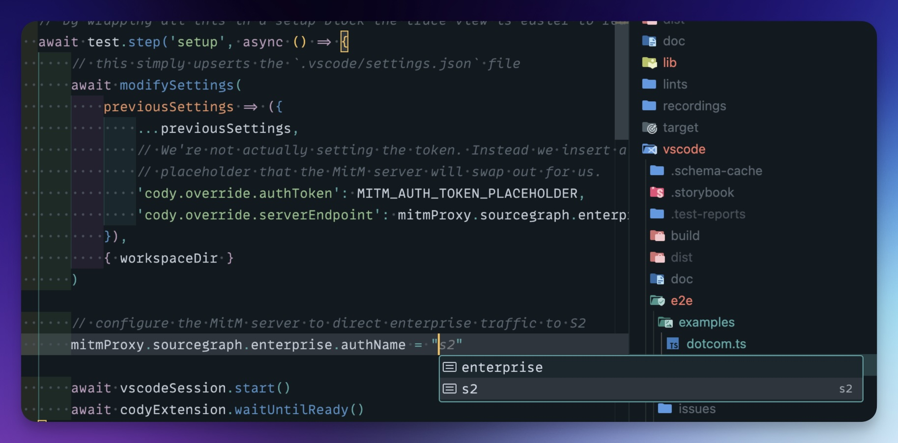

# End-To-End Testing


- [End-To-End Testing](#end-to-end-testing)
  - [Fundamental Principles](#fundamental-principles)
  - [Quick Start](#quick-start)
    - [Running tests](#running-tests)
  - [Updating Recordings](#updating-recordings)
  - [Overview](#overview)
    - [1. Playwright](#1-playwright)
    - [2. Fixture](#2-fixture)
      - [2.1 Configuration](#21-configuration)
      - [2.2 VSCode Server](#22-vscode-server)
      - [2.3 MitM Server / PollyJS](#23-mitm-server--pollyjs)
    - [3. UIX (User Interaction Extensions)](#3-uix-user-interaction-extensions)
    - [4. Tests](#4-tests)
    - [5. Isolated Resources](#5-isolated-resources)
    - [6. Test Artifacts](#6-test-artifacts)
  - [Writing Great Tests](#writing-great-tests)
      - [What Causes Flake?](#what-causes-flake)
        - [1. **Clicks are _not_ immediate**](#1-clicks-are-not-immediate)
        - [2. **Networks are _not_ predictable**](#2-networks-are-not-predictable)
        - [3. **State is _not_ for sharing**](#3-state-is-not-for-sharing)
      - [What's the Solution?](#whats-the-solution)
    - [Locators](#locators)
      - [Webviews](#webviews)
    - [Clicks](#clicks)
      - [Commands \> Clicks](#commands--clicks)
      - [Macros \> Commands](#macros--commands)
    - [Setup](#setup)
      - [Authentication](#authentication)
      - [Workspace](#workspace)
    - [Network](#network)
      - [Recordings](#recordings)
      - [Mocking](#mocking)
    - [Telemetry](#telemetry)
      - [Snapshots](#snapshots)
  - [Next Steps](#next-steps)
  - [OTHER](#other)
    - [Tools of the Trade](#tools-of-the-trade)


## Fundamental Principles

- **DX > Testing**: Nobody loves writing and maintaining tests. By prioritizing
  Developer Experience (DX), we aim to make this toolbox broadly applicable in
  your dev workflow. The goal? Turn tests into a happy automatic side-effect of
  the easiest way to hack on a new feature or fix a bug.

- **Reality > Mocking**: Flags like `env.TESTING_ENABLED` and manual mocks often
  lead to different code paths compared to production. This framework combines
  tools such as recordings, snapshot testing, and a production-quality VS Code
  server to ensure tests closely represent real-world scenarios.

- **Parallel > DRY**: By isolating every aspect of a test, we enable full
  parallel execution (even within a single test file). This might mean some
  behavior duplication between tests, but the trade-off for easier
  parallelization across machines is worth it.

- **Never Flake > Retries**: Test retries just sweep flakiness under the rug.
  And flakiness, as we all know, is the root of all testing evil.

- **Declarative > Procedural**: Tests should read like a clear declaration of
  expected behavior, not a wild goose chase of locator matches and clicks.

## Quick Start

### Running tests
```sh
cd vscode

# Pro tip: These flags and options are like Lego bricks - mix and match as you please!
# For the full menu of options, just add the --help flag.

pnpm run test:e2e2 # Builds and runs all tests (the all-in-one meal deal)
pnpm run test:e2e2:run # Skips build and runs all tests (for the impatient testers)
pnpm run test:e2e2 --debug # Runs tests in debug mode, with the Playwright Debug UI (for those who like to watch)

pnpm run test:e2e2 --grep "chat" # Runs tests matching "chat" (perfect for targeted testing)
pnpm run test:e2e2 --ui # Runs tests using the Playwright UI (for the visually inclined)
```

Make sure to leverage [playwright's tooling](Use Playwright's Tooling). My
personal favorite is the Playwright UI.



1. Trigger or watch tests with ease (no juggling required)
2. Scroll through an interactive recording to see the UI or experiment with
   locators
3. Test steps laid out neatly - no more "what just happened?" moments
4. Attachments galore: logs, telemetry dumps, and other goodies

## Updating Recordings

We use recorded network requests to keep tests flake-free and zippy. If Polly
complains about missing recordings, it means a new, unrecorded network request
snuck in. Remember, tests only make real network requests when they're in
"recording" mode. To fix this, you have two options:

Update the use statement for a specific test:



Set the `CODY_RECORD_IF_MISSING` or `CODY_RECORDING_MODE` environment variables.

> **Top Tip** 💡
> 
> VSCode can be a bit stubborn with environment variables, so
> playwright.v2.config.ts loads an optional vscode/.env file. This lets you
> toggle environment variables on the fly without rebooting your IDE (because
> who has time for that?).

```sh
# vscode/.env
CODY_RECORD_IF_MISSING=true
# ... any other environment variables you want to set
```

## Overview

The end-to-end testing framework consists of several interconnected layers and
components. Let's explore each of these, starting from the foundation and moving
up the stack.



### 1. Playwright

Our testing framework is built on [Playwright](https://playwright.dev/).
Compared to Vitest, our preferred framework for unit tests, Playwright offers a
more comprehensive feature set for UI testing. Although the VSCode project
provides a Playwright/Electron-powered e2e testing framework, we deliberately
chose not to use it. This decision was made to reduce overhead and better adhere
to the core testing principles.

### 2. Fixture

The fixture layer implements foundational and configurable components.
Playwright automatically manages dependencies between components, so simply
referencing any of these components in your test will automatically load (and
unload) the necessary dependencies.

Ideally, you shouldn't need to interact with these components directly too
often. Instead, try to capture shared logic in more high-level, reusable
components within the UIX layer.

#### 2.1 Configuration

Take a closer look at the `playwright.v2.config.ts` file and notice how you can
configure almost every aspect of this Fixture layer using the `use` semantic. 

> **Diff** The previous e2e framework required you to 'extend' a base fixture to
> override behaviour. This is now *strongly* discouraged.

The fixture components only work with configuration that has passed a
[zod](https://zod.dev/) schema check and will automatically throw an error if
the configuration is invalid or missing.

Configuration is split between worker & test configuration, allowing most
settings to be altered per test. For example:

```ts
test.describe('Test 1', () => {
    test.use({
        templateWorkspaceDir: 'workspace-1',
    })
    // ...
})

test.describe('Test 2', () => {
    test.use({
        templateWorkspaceDir: 'workspace-2',
    })
    // ...
})
```

#### 2.2 VSCode Server

Instead of relying on Electron for each test, we run a headless VSCode server
and connect a standard Playwright browser to it. Despite what you might be
thinking right now...

> 🔑 VSCode Server + Browser ≠ VSCode Web

VSCode Web runs the extension host (where Cody is executed) in the browser,
which limits access to Node.js APIs. In contrast, VSCode Server runs actual
for-realsies VSCode with only the UI displayed in a normal browser. This allows
Cody to run in a proper Node.js extension host with full API access. This
approach is functionally equivalen to running the VSCode electron application.
But with significantly less overhead and the magic ability to run in headless
mode 🔥.


#### 2.3 MitM Server / PollyJS

The Cody extension runs inside VSCode, limiting our control over network traffic
compared to Agent or Unit tests. To address this, each test is provided with a
Man-in-the-Middle (MitM) server that listens on specific ports for incoming
traffic. This traffic is then dispatched to a configurable endpoint. The server
can also merge in or replace authentication headers.

Since the MitM server runs within the test framework, you have full control over
its configuration. Importantly, network events are re-emitted from your tests,
allowing us to use PollyJS to record, manipulate, and replay network traffic,
just as we do for Agent and Unit tests. 2.4 Workspace Your test has access to a
fully isolated clone from a configurable templateWorkspaceDir. This allows you
to modify the workspace in any way during your test. For example, you can modify
the vscode/settings.json to enable specific features or run a `git init` command
(UIX helper available) to test functionality like cody-ignore. 

Not all workspace state is available in the actual filesystem. VSCode creates a
virtual user-space filesystem inside the browser's IndexDB to store sensitive
settings or extension state. While these rarely need modification, helpers are
available if needed. See `vscode/e2e/utils/vscody/uix/vscode/start.ts` for an
example. This could be used, for instance, to modify the `AnonymousUserID` state
in the Cody extension before it loads. 

Some "state," such as BFG binaries, creates considerable overhead when
downloaded for every test. To mitigate this, they are configured by default to
be stored in a shared location (../.test/global/bin). Cody has been explicitly
designed to use lockdirs to handle multiple parallel instances and share
downloads safely among them. As with all framework-level features, you can
easily reconfigure this shared download location.

### 3. UIX (User Interaction Extensions)

The UIX layer collects common Playwright selectors and actions into more
discoverable and reusable high-level functions and interfaces.

Its main goal is to provide a convenient and easily discoverable way to perform
common actions such as signing in, opening a file, or modifying HTTP response
times.

### 4. Tests

Test files run in parallel, with tests within a single file also being
parallelized. While you can opt out of this behavior using the `test.serial`
method, it's strongly recommended to avoid global state and keep tests as pure
stateless functions.

Tests can request fixture components, which can be used directly or passed to
higher-level UIX components for writing your tests.

You can run tests from the CLI, Playwright UI, or directly from VSCode using the
Playwright Plugin. By default, tests run headless (without requiring a GPU). To
view the UI, include the `--headed` or `--debug` flag.

Tests are loosely organized into projects for bundled execution. For example:

- `vscode/e2e/features` contains core functionality tests that should run as
  part of the CI pipeline.
- `vscode/e2e/issues` might contain replications of Linear issues that can be
  merged before being fixed, as these tests are not part of the CI pipeline.

This organization makes "tests" a more broadly applicable tool in your
development workflow.

### 5. Isolated Resources

The test uses fixture and UIX components to instantiate and configure several
resources outside of the test. As mentioned in Section [2.4](#24-workspace), the
workspace folder is one such resource.

Another example is the VSCode server, which is assigned a unique set of ports
for each test. This allows hundreds of parallel tests to run on the same machine
without port conflicts.

The only non-isolated resources are the hardware and the OS. As a result,
testing System Proxies is best done in a containerized or virtualized
environment. Keep in mind that running too many tests in parallel can cause
hardware bottlenecks, potentially leading to test failures.

### 6. Test Artifacts

Each test's artifacts, including workspace and VSCode server data, are stored in
the `.test/runs/RUN_ID` directory. This allows you to examine the state of a
test when it fails.

Playwright also produces several artifacts in `vscode/.test-reports`. The
`report.json` file serves as the source of truth and is automatically converted
to various formats depending on the configuration:

- Interactive Trace UI view
- HTML report
- Github Action / Buildkite compatible output

You can easily create your own test reporter. For instance you could make one
that runs on CI which publishes all the snapshotted telemetry events, which are
attached as a `telemetry.json` file, to a PubSub topic.

## Writing Great Tests

The primary focus of this framework is eliminating flake.


Flake occurs when state, timing, or external factors influence test outcomes.
This testing framework aims to eliminate flakiness in tests. Let's examine some
concrete examples of what causes flake to understand how these tools can be
helpful.

#### What Causes Flake?

##### 1. **Clicks are _not_ immediate**

When you click a button in VSCode, it dispatches an action placed in a queue.
This queue is processed separately from the main thread and might take a few
milliseconds to produce the desired result. More importantly, the timing can
vary widely.

This causes issues where tests would timeout because we would "click" a button
and then select the "first result," but the result list would be updated a few
milliseconds later. This is why you used to see many `sleeps` in the old e2e
tests.

The problem was compounded by the fact that clicks had to be used for all
interactions, even those unrelated to the behavior being tested. For instance,
opening a file would require switching to the file explorer, scrolling the tree
view, finding the element, clicking, and waiting for the file to load.

##### 2. **Networks are _not_ predictable**

Network requests can vary widely in speed or even fail altogether.

Another problem is that sending real network requests makes tests very hard to
reproduce. So if a test fails in CI, it can be really difficult to determine
what went wrong.

It isn't always the slowness of the network that causes flake. For instance,
when testing the `cancel` button after submitting a chat message, there's a
chance that the request is resolved before your test has progressed and your
`click` command has been handled by VSCode. In these cases, you'd need precise
control over request timings to ensure you have enough time to perform your
actions.

##### 3. **State is _not_ for sharing**

We had examples of tests that would change a file and then check if the UI
updated accordingly. However, if this test failed, the file was not restored,
meaning that a subsequent test would fail because the file was not in the
expected state.

Because tests were able to modify state, it also made them impossible to
parallelize, as tests could interfere with each other and required a specific
order of execution.

#### What's the Solution?

Unfortunately, there's no single magic bullet that eliminates all flake. By
disabling retries, we at least make the problem clearly visible.

By leveraging this framework, we now have a toolset that we can use to address
any flake issues as they occur. Let's look at some common scenarios and best
practices.

### Locators

[Locators](https://playwright.dev/docs/locators) are used to find and interact
with elements on the page. Writing reliable locators is crucial for stable
tests.

The most reliable way is by assigning a `test-id` to a DOM node and using that.

```ts
// <div class="chat-view">
//    <button data-testid="tab-user">Me</button>
//    <button data-testid="tab-account">Account Settings</button>
//    ...
// </div>
await page.locator('div.chat-view button').nth(2) // ❌
await sidebar.content.getByTestId('tab-account').click() // ✅
```

However that only works if there is a single unique semantic element of that
"id" on the page.

Locators can be chained to narrow down the search to a particular part of the
page.

```ts
const product = page.getByRole('listitem').filter({ hasText: 'Product 2' });
```

You can also filter locators by text or by another locator.

```ts
await page
    .getByRole('listitem')
    .filter({ hasText: 'Product 2' })
    .getByRole('button', { name: 'Add to cart' })
    .click();
```

Playwright recommends using user-facing attributes to XPath or CSS selectors.
However sometimes the DOM structure is more stable than the user facing text.
For instance keyboard shortcuts text might be subject to frequent changes. So in
general try and use selectors that rely on the most stable and semantically
relevant information.

#### Webviews

A quick note about WebViews. Within VSCode extensions has two options for
rendering UI elements. Either it provides some configuration of UI components
which are rendered by VSCode themselves (such as tree-view, or status-bar).
Alternatively the extension can provide a custom `html/js` entrypoint which is
rendered within an IFrame, called a WebView.

Locators can't pass between the top-level frame and the webview frame. If you
want to select anything inside of a webview you HAVE to use the `frameLocator`
to first get the root iframe of that WebView.

### Clicks

Clicks are often a source of flakiness in tests due to their asynchronous nature
and potential for timing issues.

One good rule of thumb is to follow every click with a expect statement that
validates the click was successful. This is because `expect` statements halt
execution until the assertion is met (or times out). This makes them much more
reliable and performant than `sleep` statements.

Locators come with auto waiting and retry-ability. Auto waiting means that
Playwright performs a range of actionability checks on the elements, such as
ensuring the element is visible and enabled before it performs the click.

```ts
await cody.statusBar.click() // 1. click
await expect(session.QuickPick.items({ hasText: 'Cody is disabled in this file' })).toBeVisible() // 2. assert success with an expect
await cody.statusBar.filter({hasText: 'Cody is disabled'}).click() // 3. Clicks can themselves also serve as an assertion.
```

When a test fails you can always look at the trace recording to get a
visualization of where the locator was pointing.

It is also best to reseve clicks when part of the actual behaviour being tested.
For instance, don't use clicks to open a file or prepare other test conditions.
We have much more powerfull and flake-free alternatives to do so...

#### Commands > Clicks

Instead of using clicks, you can simply dispatch VSCode commands. This has the
added benefit of automatically being followed by a "process" step for VSCode to
handle the queue of pending commands.

For example, opening Cody:

```ts
/**
 * ❌ Previously we would find the sidebar 
 * and click the Cody button
 */

// In case the cody sidebar isn't focused, select it.
while (!(await isSidebarVisible(page))) {
    await page.click('[aria-label="Cody"]')
}

/**
 *  ❌ Or use a UI-based
 * "invoke command"
 */
await page.keyboard.press('F1')
await expect(page.getByPlaceholder('Type the name of a command to run.')).toBeVisible({
    timeout: 1000,
})
await page.getByPlaceholder('Type the name of a command to run.').fill(`>${commandName}`)
await page.keyboard.press('Enter')

/**
 * ✅ Now we can dispatch commands
 * without any UI interaction 🤯
 */
await vscodeSession.runCommand('workbench.action.closeAllEditors')
```

To find out what command to run, you can easily open `> Preferences: Open
Keyboard Shortcuts` and then right-click on any of the commands to copy the
command ID.



#### Macros > Commands

Not all behaviors have a command available. For instance, even something as
simple as opening a file does not have a command available in VSCode. This can
only be done through the VSCode API, which is exactly what the `macro` allows
you to do.

For example, this is how `runMacro` is used in the UIX VSCode Editor helper to
provide `OpenFile`:

```ts
async openFile(args: OpenFileArgs) {
  // by making it a step it shows up in the trace as a single command
  return t.step('Editor.openFile', async () => { 
      const file = await this.session.runMacro(
          // Just some identifier for the macro to show in the trace view
          'uix:openFile',
          // IMPORTANT: This is explicitly not a arrow function. 
          // This way the framework provides a `this` context to 
          // give type-safe access to the VSCode API and other utilities.
          async function (args) {
              const { file = `\${workspaceFolder}/${args.workspaceFile}`, viewColumn } = args
              // this.vscode ... the full power of the VSCode API
              const uri = this.vscode.Uri.file(this.utils.substitutePathVars(file))
              const showOptions = { preserveFocus: true, preview: false, viewColumn }
              // this command isn't available outside of the extension api
              await this.vscode.commands.executeCommand('vscode.open', uri, showOptions)
              // values can be returned, as long as they are serializable
              return uri
          },
          [args] // arguments are serialized and passed to the macro
      )
      // It comes back JSON serialized, so we need to parse it
      const uri = URI.from(file)
      ...
}
```

as well as the and `Select` utilities:

```ts
async select(args: SelectArgs) {
        return await this.session.runMacro(
            'uix:select',
            async function (args) {
                const editor = this.vscode.window.activeTextEditor
                if (!editor) {
                    throw new Error('No editor is active')
                }
                ...
                editor.selections = [new this.vscode.Selection(fromPosition, toPosition)]
                editor.revealRange(
                    editor.selection,
                    this.vscode.TextEditorRevealType.InCenterIfOutsideViewport
                )
            },
            [args]
        )
    }
}
```

This works because of a special "Testing Extension" which is loaded by the fixture. This extension provides an `eval` command that takes an arbitrary JavaScript string as input and executes it. The rest is just some typing magic. You can find more details in `vscode/e2e/utils/vscody/extension/main.js`

### Setup

Now that we have the basics down let's set up a test.

#### Authentication

Unless you're testing the auth flow, there's no real reason to start your test with authentication flow. Instead you can use the hidden `cody.override.authToken` and `cody.override.serverEndpoint` settings to pre-authenticate your extension.

Here's a basic example of how to start a DotCom session:

```ts
// vscode/e2e/examples/dotcom.test.ts
import { fixture as test, uix } from '../utils/vscody'
import { MITM_AUTH_TOKEN_PLACEHOLDER } from '../utils/vscody/constants'
import { modifySettings } from '../utils/vscody/uix/workspace'

test.use({
    templateWorkspaceDir: 'test/fixtures/legacy-polyglot-template',
})
test('DotCom', async ({ page, mitmProxy, vscodeUI, workspaceDir }) => {
    // This prepares VSCode in the background but doesn't open the browser yet.
    // This gives you some time to "prepare" you session
    const vscodeSession = uix.vscode.Session.pending({ page, vscodeUI, workspaceDir })
    const codyExtension = uix.cody.Extension.with({ page, workspaceDir })

    // by wrapping all this in a setup block the trace view is easier to read
    await test.step('setup', async () => {
        // this simply upserts the `.vscode/settings.json` file
        await modifySettings(
            previousSettings => ({
                ...previousSettings,
                // We're not actually setting the token. Instead we insert a
                // placeholder that the MitM server will swap out for us.
                'cody.override.authToken': MITM_AUTH_TOKEN_PLACEHOLDER,
                'cody.override.serverEndpoint': mitmProxy.sourcegraph.dotcom.endpoint,
            }),
            { workspaceDir }
        )

        await vscodeSession.start()
        await codyExtension.waitUntilReady()
    })

    // GL HF
})
```

Connecting to enterprise can be done very similarly. You just have to change

```ts
'cody.override.serverEndpoint': mitmProxy.sourcegraph.enterprise.endpoint,
```

Remember, the endpoint here refers to the endpoint of the MitM server that intercepts the traffic. This MitM server only has two ports, one speaking "DotCom" and the other speaking "Enterprise SG".

So how do you connect to a different S2 instance? Well you can just re-configure the MitM server to forward traffic to a different endpoint! This is done by setting a different `authName`.



This also automatically configures the correct auth token.

> **Note**
>
> Local SG instances are coming soon.

#### Workspace

As mentioned before, the test's workspace is a copy of the template workspace. Which can be configured by setting the `templateWorkspaceDir` option.

```ts
test.use({
    templateWorkspaceDir: 'test/fixtures/legacy-polyglot-template',
})
```

### Network

#### Recordings

#### Mocking

### Telemetry

#### Snapshots


## Next Steps
- Allowing a user to "record" their issue as a test in a production build.
- Full local-only end-to-end tests including locally runing backend instances.
  This would allow us to more easily develop and verify fullstack changes.
- Install extension from built `.visx` file to ensure production builts are
  test.
- A way to manipulate time in the extension. This would allow us to "fast
  forward" 15 seconds to check that some telemetry event has fired etc.
- "Migrate" and expand Authentication tests. This components feels like a prime
  candidate for thorough testing of core functionality and all edge-cases such
  as network issues, timeouts, misconfigurations, etc.
- Being able to record VSCode 'interactions' for better test recording
- Capturing traces; include as attachments, allow asserts etc.


## OTHER

### Tools of the Trade

Productivity tips

uix.sleep()

stretchTimeout()


Use Soft assertions If your test fails, Playwright will give you an error
message showing what part of the test failed which you can see either in VS
Code, the terminal, the HTML report, or the trace viewer. However, you can also
use soft assertions. These do not immediately terminate the test execution, but
rather compile and display a list of failed assertions once the test ended.

// Make a few checks that will not stop the test when failed... await
expect.soft(page.getByTestId('status')).toHaveText('Success');

// ... and continue the test to check more things. await page.getByRole('link',
{ name: 'next page' }).click();
